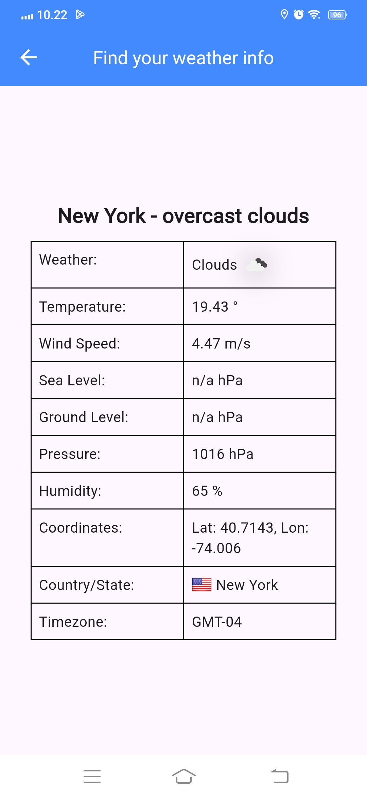

# 🌦️Flutter Weather Tracking App

Hi Future Developer!

Welcome to Weather Tracker, your one-stop solution for all your weather tracking needs! This app, built using the powerful Flutter framework and Dart language, provides real-time weather updates, forecasts, and much more. Whether you're planning a trip or just curious about the weather, our app has got you covered!

## ✨ Features:

- **Real-Time Weather Data**: Get up-to-the-minute weather updates for your location.
- **Global Coverage**: Access weather information for any location around the globe.
- **User-Friendly Interface**: Enjoy a sleek, intuitive design that makes weather tracking a breeze.

## 🚀 Getting Started

Follow these steps to get a local copy up and running.

#### Prerequisites

Make sure you have Flutter installed on your machine. If not, follow the official [Flutter installation guide](https://docs.flutter.dev/get-started/install).

#### Installation

1. Clone the repo 
```sh 
git clone https://github.com/novaardiansyah/flutter-weather-tracking.git
```
2. Navigate to the project directory
```sh 
cd flutter-weather-tracking
```
3. Install dependencies
```sh
flutter pub get
```
4. Run the app
```sh
flutter run
```

## 🛠️ Built With

- [Flutter](https://flutter.dev/) - The powerful UI toolkit for building natively compiled applications for mobile, web, and desktop from a single codebase.
- [Dart](https://dart.dev/) - The programming language optimized for building mobile, desktop, server, and web applications.
## 🌟 Sneak Peek 

Get a glimpse of the app's enchanting world by exploring the current progress at [not-available](). Feast your eyes on these snapshots that showcase the app's dynamic essence:

<div style="margin-bottom: 5px">
  
</div>

## 🤝 Contributing

Contributions are what make the open-source community such an amazing place to learn, inspire, and create. Any contributions you make are **greatly appreciated**.

1. Fork the Project
2. Create your Feature Branch (`git checkout -b feature/AmazingFeature`)
3. Commit your Changes (`git commit -m 'Add some AmazingFeature'`)
4. Push to the Branch (`git push origin feature/AmazingFeature`)
5. Open a Pull Request

## 📝 License

Distributed under the MIT License. See [LICENSE](https://github.com/novaardiansyah/flutter-weather-tracking/blob/main/LICENSE) for more information.

## 📞 Let's Connect!

Need to chat? Feel free to drop me a line via [Email](mailto:novaardiansyah78@gmail.com) or hit me up on  [Whatsapp](https://wa.me/6289506668480?text=Hi%20Nova,%20I%20have%20a%20question%20about%20your%20project:%20https://github.com/novaardiansyah/flutter-weather-tracking/) I'm just a message away, ready to groove with you! 📩

---

Thank you for checking out Weather Tracker! We hope you enjoy using it as much as we enjoyed building it. Happy coding! 🚀